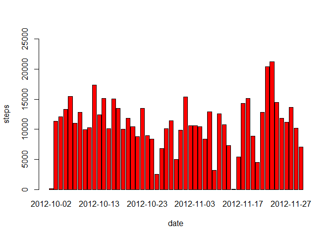
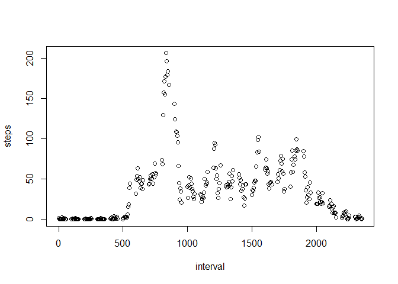
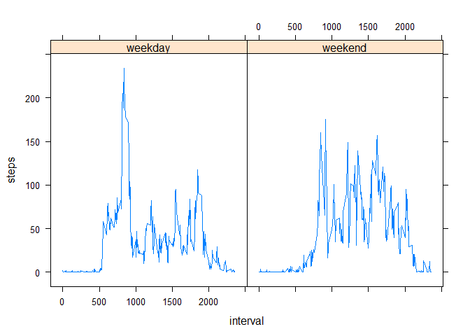

# Reproducible Research: Peer Assessment 1


## Loading and preprocessing the data

```r
setwd("C:/Users/Rakesh Chatrath/Coursera Data Science/Reproducible Research/Week 1")
dat <- read.csv("activity.csv", colClass = c('integer', 'Date', 'integer'))
```


## What is mean total number of steps taken per day?

The total number of steps taken per day is:

```r
steps.date <- aggregate(steps ~ date, dat, sum)
head(steps.date)
```

```
##         date steps
## 1 2012-10-02   126
## 2 2012-10-03 11352
## 3 2012-10-04 12116
## 4 2012-10-05 13294
## 5 2012-10-06 15420
## 6 2012-10-07 11015
```
The histogram of the number of steps taken per day: 

```r
barplot(steps.date$steps, names.arg = steps.date$date, ylim = c(0, 25000), col = "red", xlab = 
"date", ylab = "steps")
```

 
The mean:

```r
mean(steps.date$steps)
```

```
## [1] 10766.19
```

## What is the average daily activity pattern?
The following is a time series plot of the 5 minute intervals and the number of steps taken averaged across all of the days. 

```r
interval <- aggregate(steps ~interval, dat, mean)
plot(interval, plot.type = "single")
```

```
## Warning in plot.window(...): "plot.type" is not a graphical parameter
```

```
## Warning in plot.xy(xy, type, ...): "plot.type" is not a graphical parameter
```

```
## Warning in axis(side = side, at = at, labels = labels, ...): "plot.type" is
## not a graphical parameter
```

```
## Warning in axis(side = side, at = at, labels = labels, ...): "plot.type" is
## not a graphical parameter
```

```
## Warning in box(...): "plot.type" is not a graphical parameter
```

```
## Warning in title(...): "plot.type" is not a graphical parameter
```

 
The following ouput is the interval containing the most steps 

```r
interval$interval[which.max(interval$steps)]
```

```
## [1] 835
```


## Imputing missing values
The method of choice for imputing missing data is based off of the mean

```r
dat_clean <- merge(dat, steps.date, by="date", suffixes=c("", ".mean"))
nas <- is.na(dat_clean$steps)
dat_clean$steps[nas] <- dat_clean$steps.mean[nas]
dat_clean <- dat_clean[, c(1:3)]
head(dat_clean)
```

```
##         date steps interval
## 1 2012-10-02     0     1740
## 2 2012-10-02     0     1715
## 3 2012-10-02     0     1725
## 4 2012-10-02     0     1710
## 5 2012-10-02     0     1735
## 6 2012-10-02     0     1855
```
Frequency: 

```r
steps.date <- aggregate(steps ~ date, dat_clean, sum)

barplot(steps.date$steps, names.arg = steps.date$date, ylim = c(0, 25000), col = "red", xlab = "date", ylab = "steps")
```

 
The mean

```r
mean(steps.date$steps)
```

```
## [1] 10766.19
```
The median

```r
median(steps.date$steps)
```

```
## [1] 10765
```


## Are there differences in activity patterns between weekdays and weekends?
Function to separate based on type of day

```r
type <- function(dates) {
    f <- function(date) {
        if (weekdays(date) %in% c("Saturday", "Sunday")) {
            "weekend"
        }
        else {
            "weekday"
        }
    }
    sapply(dates, f)
}

dat$dayType <- as.factor(type(dat$date))
str(dat)
```

```
## 'data.frame':	17568 obs. of  4 variables:
##  $ steps   : int  NA NA NA NA NA NA NA NA NA NA ...
##  $ date    : Date, format: "2012-10-01" "2012-10-01" ...
##  $ interval: int  0 5 10 15 20 25 30 35 40 45 ...
##  $ dayType : Factor w/ 2 levels "weekday","weekend": 1 1 1 1 1 1 1 1 1 1 ...
```
Panel plot: 

```r
library(lattice)
interval <- aggregate(steps ~ interval + dayType, dat, mean)
xyplot(steps ~ interval | dayType, data=interval, layout=c(2,1), type='l')
```

 
